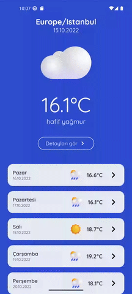
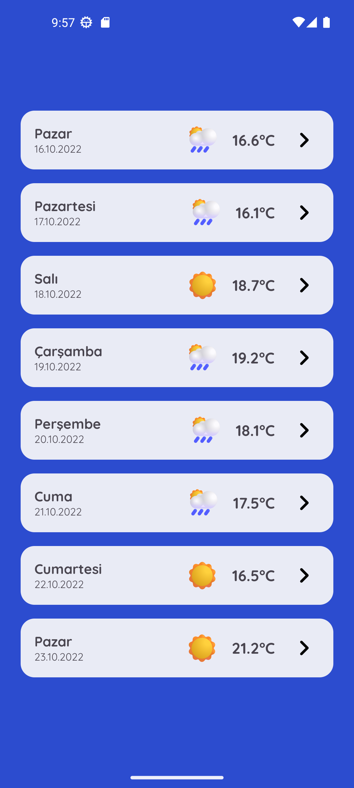
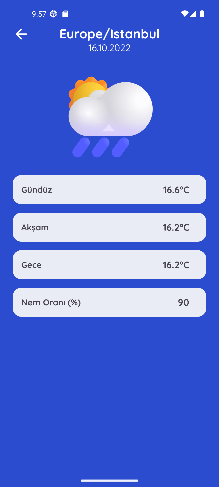

<div align="center">
    <a>
        
    </a>
    <h3 align="center">WeatherApp</h3>
    <p align="center">
        WeatherApp is a weather forecast application developed at <a href="patika.dev">Patika</a>'s Pazarama Android Bootcamp.
        <br />
        <br />
        <a href="#try">Try WeatherApp</a>
        ·
        <a href="https://github.com/erdemklync/WeatherApp/issues">Report Bug</a>
        ·
        <a href="https://github.com/erdemklync/WeatherApp/issues">Request Feature</a>
    </p>
</div>

## About The Project

<table align="center">
  <tr>
    <td></td>
    <td></td>
    <td></td>
  </tr>
</table>

Technologies and libraries used in this project:
<ul>
  <li>Kotlin</li>
  <li>ViewModel</li>
  <li>Weather API</li>
  <li>Retrofit</li>
  <li>Interceptor</li>
  <li>LiveData</li>
  <li>Recyclerview</li>
  <li>MotionLayout</li>
</ul>

<span id="try"></span>
## Try WeatherApp
You can clone the repo

```sh
  git clone https://github.com/erdemklync/WeatherApp.git
```

or

download the APK file <a href="https://github.com/erdemklync/WeatherApp/releases/tag/1.0">here</a>.


## Contact

LinkedIn - [https://linked.in/p/erdemkalyoncu](https://linked.in/p/erdemkalyoncu)<br />
Medium - [https://medium.com/@erdemklync](https://medium.com/@erdemklync)<br />
YouTube - [https://www.youtube.com/c/ErdemKalyoncu](https://www.youtube.com/c/ErdemKalyoncu)<br />

See my other projects: [https://github.com/erdemklync](https://github.com/erdemklync)
